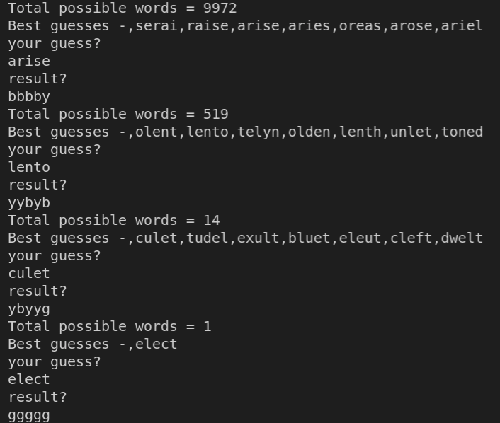
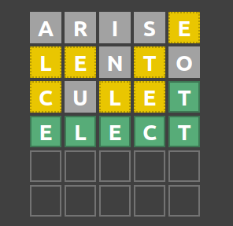

# wordle

## Instruction to use

1. At every step, 5 best words will be suggested and the count number of possible words will be printed

2. for every attempt, write your word on the first line and the result on the next line. 
3. g, y, b, would be used for green, yellow and black

